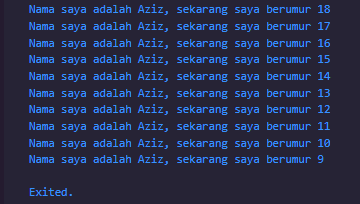
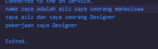

# Soal 1
### Modifikasilah kode pada baris 3 di VS Code atau Editor Code favorit Anda berikut ini agar mendapatkan keluaran (output) sesuai yang diminta!

```dart
void main(){
  for (int i = 0; i < 10>; i++) {
    print('hello ${i + 2}');
  }
}
```
### Output yang diminta (Gantilah Fulan dengan nama Anda):
```
Nama Saya adalah Fulan Sekarang berumur 18
Nama Saya adalah Fulan Sekarang berumur 17
Nama Saya adalah Fulan Sekarang berumur 16
Nama Saya adalah Fulan Sekarang berumur 15
Nama Saya adalah Fulan Sekarang berumur 14
Nama Saya adalah Fulan Sekarang berumur 13
Nama Saya adalah Fulan Sekarang berumur 12
Nama Saya adalah Fulan Sekarang berumur 11
Nama Saya adalah Fulan Sekarang berumur 10
Nama Saya adalah Fulan Sekarang berumur 9
```

# Jawaban: 
```dart
void main() {
  for (int i = 18; i > 8; i--) {
    print('Nama saya adalah Aziz, sekarang saya berumur ${i}');
  }
}
```
### Screenshot: <br>


# Soal 2
### Mengapa sangat penting untuk memahami bahasa pemrograman Dart sebelum kita menggunakan framework Flutter ? Jelaskan!

# Jawaban:
Karena flutter merupakan framework dan flutter menggunakan bahasa pemgrograman dart. Kalau kurang memahami bahasa pemrograman dart nanti jadi sedikit kesusahan dalam memanfaatkan fitur flutter

# Soal 3
### Rangkumlah materi dari codelab ini menjadi poin-poin penting yang dapat Anda gunakan untuk membantu proses pengembangan aplikasi mobile menggunakan framework Flutter.

# Jawaban

- Pengembangan framework Flutter melibatkan bahasa Dart; Kode aplikasi, kode plugin, dan manajemen dependensi semuanya menggunakan bahasa Dart.
- Kode Dart dapat beroperasi dalam dua mode — kompilasi Just-In-Time (JIT) atau Kompilasi Ahead-Of-Time (AOT).
- Dart dirancang untuk object-oriented
- Operasi Aritmatika dart mirip dengan bahasa pemrograman yang lain juga

# Soal 4
### Buatlah penjelasan dan contoh eksekusi kode tentang perbedaan Null Safety dan Late variabel !

# Jawaban
- NullSafety: boleh diisi dengan null ketika membuat variable
- Late Variable: variable akan diisi belakangan
```dart
//Contoh Null Safety

void nullSafety() {
  // nullsafety
  String nama = 'aziz'; // harus bernilai
  String? pekerjaan = null; // boleh bernilai null

  if (nama == 'aziz' && pekerjaan == null) {
    // jika nama tidak null dan pekerjaan null output seperti ini " nama saya adalah aziz saya seorang mahasiswa"
    print(
      'nama saya adalah ${nama}'
      ' saya seorang mahasiswa',
    );
  } else {
    // jika nama tidak null dan pekerjaan sudah ada isi output seperti ini
    print(
      'nama saya ${nama}'
      ' saya seorang ${pekerjaan}',
    );
  }
  if (pekerjaan == null) {
    // jika pekerjaan masih null output seperti ini "saya aziz dan saya seorang designer"
    pekerjaan ??= 'Designer';
    print('saya ${nama} dan saya seorang ${pekerjaan}');
  }
}

// contoh late variable
void lateVariable() {
  late String pekerjaan; // bisa diisi belakangan
  pekerjaan = 'Designer'; // isi late variable
  print('pekerjaan saya ${pekerjaan}'); // output 'Designer'
}

void main() {
  nullSafety();
  lateVariable();
}
```
### Output



