# Tugas Praktikum

## 1. Silakan selesaikan Praktikum 1 sampai 5, lalu dokumentasikan berupa screenshot hasil pekerjaan Anda beserta penjelasannya!

### Praktikum 1: Eksperimen Tipe Data List

#### Langkah 1

Ketik atau salin kode program berikut ke dalam void main().

```dart
var list = [1, 2, 3];
assert(list.length == 3);
assert(list[1] == 2);
print(list.length);
print(list[1]);

list[1] = 1;
assert(list[1] == 1);
print(list[1]);
```

#### Langkah 2

Silakan coba eksekusi (Run) kode pada langkah 1 tersebut. Apa yang terjadi? Jelaskan!

#### Jawab:

#### Screenshot:

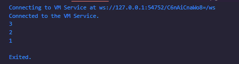

Kode tersebut, menjalankan membuat list sebanyak 3, kemudian menjalankan perintah assert untuk mengecek panjang list apakah sama dengan 3. kemudian mengecek isi list 1 apakah sama dengan 2. Jika kedua kondisi tersebut bernilai benar maka akan melakukan perintah print panjang list dan list isi ke 1. Selanjutnya list 1 di isi dengan 1 kemudian mengecek apakah list ke 1 sama dengan 1. Jika benar maka akan melakukan print list ke 1.

#### Langkah 3

Ubah kode pada langkah 1 menjadi variabel final yang mempunyai index = 5 dengan default value = null. Isilah nama dan NIM Anda pada elemen index ke-1 dan ke-2. Lalu print dan capture hasilnya.

Apa yang terjadi ? Jika terjadi error, silakan perbaiki.

```dart
final List listBio = List<String?>.filled(5, null);
  listBio[1] = 'Nur Aziz';
  listBio[2] = '2341720237';
  print('Panjang List: ${listBio.length}');
  print('Isi List ${listBio}');
  print('Nama: ${listBio[1]}');
  print('NIM: ${listBio[2]}');
```

#### Screenshot:

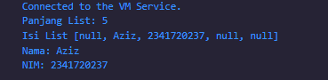

Deklarasi var final bertipe String dengan nullSafety sehingga bisa secara default dan bernilai null, kemudian berikan jumlah indexnya. Berikan nilai pada index ke 1 dan 2 dengan nama dan NIM, kemudian print panjang, isi, index ke 1 dan ke 2.

### Praktikum 2: Eksperimen Tipe Data Set

### Langkah 1:

Ketik atau salin kode program berikut ke dalam fungsi main().

```dart
var halogens = {'fluorine', 'chlorine', 'bromine', 'iodine', 'astatine'};
print(halogens);
```

#### Langkah 2

Silakan coba eksekusi (Run) kode pada langkah 1 tersebut. Apa yang terjadi? Jelaskan! Lalu perbaiki jika terjadi error.

#### Jawab:

Mendeklarasikan variable halogens dan menampilkan isi variable halogens

#### Screenshot:

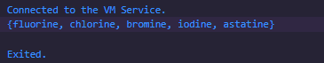

#### Langkah 3:

Tambahkan kode program berikut, lalu coba eksekusi (Run) kode Anda.

```dart
var names1 = <String>{};
Set<String> names2 = {}; // This works, too.
var names3 = {}; // Creates a map, not a set.

print(names1);
print(names2);
print(names3);
```

Apa yang terjadi ? Jika terjadi error, silakan perbaiki namun tetap menggunakan ketiga variabel tersebut. Tambahkan elemen nama dan NIM Anda pada kedua variabel Set tersebut dengan dua fungsi berbeda yaitu .add() dan .addAll(). Untuk variabel Map dihapus, nanti kita coba di praktikum selanjutnya.

#### Jawab:

- var names1 = <string>{}; : merupakan sebuah set kosong bertipe string eksplisit
- Set<String> names2 = {}; : Set kosong bertipe String dengan deklarasi tipe
- var names3 = {};: adalah sebuah Map kosong dan bukan sebuah Set

#### Penambahan Kode

```dart
var names1 = <String>{};
  Set<String> names2 = {}; // This works, too.
  var names3 = <String>{}; // Creates a map, not a set.

  // .add
  names2.add('Nur Aziz');
  names2.add('2341720237');

  // .addAll
  names3.addAll(names2);

  print("names1 : $names1");
  print("names2 : $names2");
  print("names3 : $names3");
```

#### Screenshot:

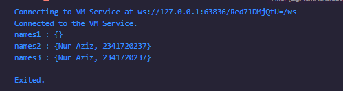
Dokumentasikan code dan hasil di console, lalu buat laporannya.

## Praktikum 3: Eksperimen Tipe Data Maps

### Langkah 1:

Ketik atau salin kode program berikut ke dalam fungsi main().

```dart
var gifts = {
  // Key:    Value
  'first': 'partridge',
  'second': 'turtledoves',
  'fifth': 1
};

var nobleGases = {
  2: 'helium',
  10: 'neon',
  18: 2,
};

print(gifts);
print(nobleGases);
```

### Langkah 2:

Silakan coba eksekusi (Run) kode pada langkah 1 tersebut. Apa yang terjadi? Jelaskan! Lalu perbaiki jika terjadi error.

#### Screenshot:

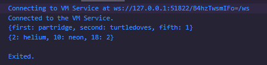

#### Jawab:

Menampilkan isi dari variable gifts dan nobleGases

### Langkah 3:

Tambahkan kode program berikut, lalu coba eksekusi (Run) kode Anda.

```dart
var mhs1 = Map<String, String>();
gifts['first'] = 'partridge';
gifts['second'] = 'turtledoves';
gifts['fifth'] = 'golden rings';

var mhs2 = Map<int, String>();
nobleGases[2] = 'helium';
nobleGases[10] = 'neon';
nobleGases[18] = 'argon';
```

Apa yang terjadi ? Jika terjadi error, silakan perbaiki.

### Jawab:

Menampilkan value dari var gifts dan nobleGases

Tambahkan elemen nama dan NIM Anda pada tiap variabel di atas (gifts, nobleGases, mhs1, dan mhs2). Dokumentasikan hasilnya dan buat laporannya!

#### Screenshot:

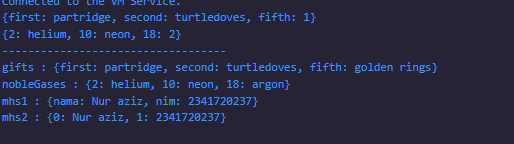

#### Penambahan Kode

```dart
  print("-----------------------------------");
  // langkah 3
  var mhs1 = Map<String, String>();
  mhs1['nama'] = 'Nur aziz';
  mhs1['nim'] = '2341720237';
  gifts['first'] = 'partridge';
  gifts['second'] = 'turtledoves';
  gifts['fifth'] = 'golden rings';

  var mhs2 = Map<int, String>();
  mhs2[0] = 'Nur aziz';
  mhs2[1] = '2341720237';
  nobleGases[2] = 'helium';
  nobleGases[10] = 'neon';
  nobleGases[18] = 'argon';

  // print output
  print("gifts : $gifts");
  print("nobleGases : $nobleGases");
  print("mhs1 : $mhs1");
  print("mhs2 : $mhs2");
```

## Praktikum 4: Eksperimen Tipe Data List: Spread dan Control-flow Operators

### Langkah 1:

Ketik atau salin kode program berikut ke dalam fungsi main().

```dart
var list = [1, 2, 3];
var list2 = [0, ...list];
print(list1);
print(list2);
print(list2.length);
```

### Langkah 2:

Silakan coba eksekusi (Run) kode pada langkah 1 tersebut. Apa yang terjadi? Jelaskan! Lalu perbaiki jika terjadi error.

#### Jawab:

- Terjadi error, karena terdapat kesalahan penulisan kode print(list1) seharusnya print(list).
- menampilkan value dari list dan list2 kemudian menampilkan jumlah list2.
- fungsi dari ...list adalah memasukkan semua elemen dari list ke list2

#### Penambahan Kode

```dart
  var list = [1, 2, 3];
  var list2 = [0, ...list];
  print(list);
  print(list2);
  print(list2.length);
```

#### Screenshot:

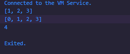

### Langkah 3:

Tambahkan kode program berikut, lalu coba eksekusi (Run) kode Anda.

```dart
list1 = [1, 2, null];
print(list1);
var list3 = [0, ...?list1];
print(list3.length);
```

Apa yang terjadi ? Jika terjadi error, silakan perbaiki.
Tambahkan variabel list berisi NIM Anda menggunakan Spread Operators. Dokumentasikan hasilnya dan buat laporannya!

#### Jawab:

- Terjadi error, karena variable list1 belum ada, sehingga harus dikeklarasikan terlebih dahulu.
- ...? digunakan untuk memasukkan data list dan dapat bernilai null

```dart
  var list1 = [1, 2, null];
  print("list1: $list1");
  var nim = [2341720237];
  print("nim: $nim");
  var list3 = [0, ...?list1, ...?nim];
  print("list3: $list3");
  print("list3 length: ${list3.length}");
```

#### Screenshot:

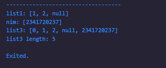

### Langkah 4:

Tambahkan kode program berikut, lalu coba eksekusi (Run) kode Anda.

```dart
var nav = ['Home', 'Furniture', 'Plants', if (promoActive) 'Outlet'];
print(nav);
```

Apa yang terjadi ? Jika terjadi error, silakan perbaiki. Tunjukkan hasilnya jika variabel promoActive ketika true dan false.

#### Jawab:

- tidak bisa, karena var promoActive belum ada.

```dart
  List<String> nav(bool promoActive) {
    return ['Home', 'Furniture', 'Plants', if (promoActive) 'Outlet'];
  }

  print("jika true: ${nav(true)}");
  print("jika false: ${nav(false)}");
```

#### Screenshot:

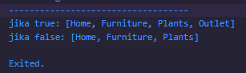

### Langkah 5:

Tambahkan kode program berikut, lalu coba eksekusi (Run) kode Anda.

```dart
var nav2 = ['Home', 'Furniture', 'Plants', if (login case 'Manager') 'Inventory'];
print(nav2);
```

Apa yang terjadi ? Jika terjadi error, silakan perbaiki. Tunjukkan hasilnya jika variabel login mempunyai kondisi lain.

#### Jawab:

- terjadi error karena tidak ada var login
- terdapat beberapa if yang akan dijalankan jika terpenuhi

```dart
List<String> nav2(String login) {
    return [
      'Home',
      'Furniture',
      'Plants',
      if (login case 'Manager') 'Inventory',
      if (login case 'Admin') 'Outlet',
      if (login case 'Customer') 'Cart',
    ];
  }

  print('login == Manager: ${nav2('Manager')}');
  print('login == Admin: ${nav2('Admin')}');
  print('login == Customer: ${nav2('Customer')}');
```

#### Screenshoot:

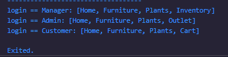

### Langkah 6:

Tambahkan kode program berikut, lalu coba eksekusi (Run) kode Anda.

```dart
var listOfInts = [1, 2, 3];
var listOfStrings = ['#0', for (var i in listOfInts) '#$i'];
assert(listOfStrings[1] == '#1');
print(listOfStrings);
```

Apa yang terjadi ? Jika terjadi error, silakan perbaiki. Jelaskan manfaat Collection For dan dokumentasikan hasilnya.

#### Jawab:

- indeks pertama #0
- tedapat iterasi listOfInts pada listOfStrings yang dimana setiap iterasi menambahkan bagian listOfInts ke dalam listOfStrings
- assert untuk validasi hasil sesuai atau tidak

#### Screenshot:

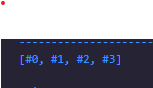

## Praktikum 5: Eksperimen Tipe Data Records

### LAngkah 1:

Ketik atau salin kode program berikut ke dalam fungsi main()

```dart
var record = ('first', a: 2, b: true, 'last');
print(record)
```

### Langkah 2:

Silakan coba eksekusi (Run) kode pada langkah 1 tersebut. Apa yang terjadi? Jelaskan! Lalu perbaiki jika terjadi error.

#### Jawab:

- kode error, karena tidak ada ";" di print(record)
- dalam record memiliki 2 positional fields: 'first' (index 0) dan 'last' (index 1) 2 named fields: a: 2 dan b: true
- Records merupakan tipe data immutable yang mengelompokkan beberapa nilai Positional fields diakses dengan $1, $2, dst. Named fields diakses dengan nama fieldnya (.a, .b)

```dart
  var record = ('first', a: 2, b: true, 'last');
  print(record);
```

#### Screenshot:

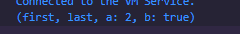

### Langkah 3:

Tambahkan kode program berikut di luar scope void main(), lalu coba eksekusi (Run) kode Anda.

```dart
(int, int) tukar((int, int) record) {
  var (a, b) = record;
  return (b, a);
}
```

Apa yang terjadi ? Jika terjadi error, silakan perbaiki. Gunakan fungsi tukar() di dalam main() sehingga tampak jelas proses pertukaran value field di dalam Records.

#### Jawab:

- tidak muncul apapun, karena fungsi tukar tidak dipanggil
- membuat var baru untuk menggunakan fungsi tukar

```dart
  print("----------langkah 3----------");
  var sebelum = (1, 2);
  var sesudah = tukar(sebelum);

  print("sebelum: $sebelum");
  print("sesudah: $sesudah");
```

#### Screenshot:

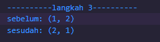

### Langkah 4:

Tambahkan kode program berikut di dalam scope void main(), lalu coba eksekusi (Run) kode Anda.

```dart
// Record type annotation in a variable declaration:
(String, int) mahasiswa;
print(mahasiswa);
```

Apa yang terjadi ? Jika terjadi error, silakan perbaiki. Inisialisasi field nama dan NIM Anda pada variabel record mahasiswa di atas. Dokumentasikan hasilnya dan buat laporannya!

#### Jawab:

- terjadi error karena deklarasi var tidak memakai nullSafety sehingga terjadi error, untuk mengatasinya bisa pakai nullSafety atau juga ditambahkan inisiasi

```dart
  (String, int)? mahasiswa = ('Nur aziz', 2341720237);
  print(mahasiswa);
```

#### Screenshot:

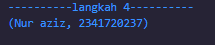

### Langkah 5:

Tambahkan kode program berikut di dalam scope void main(), lalu coba eksekusi (Run) kode Anda.

```dart
var mahasiswa2 = ('first', a: 2, b: true, 'last');

print(mahasiswa2.$1); // Prints 'first'
print(mahasiswa2.a); // Prints 2
print(mahasiswa2.b); // Prints true
print(mahasiswa2.$2); // Prints 'last'
```

Apa yang terjadi ? Jika terjadi error, silakan perbaiki. Gantilah salah satu isi record dengan nama dan NIM Anda, lalu dokumentasikan hasilnya dan buat laporannya!

#### jawab:

- menampilkan output dari mahasiswa2 dengan mengambil value tertentu

#### Screenshot:

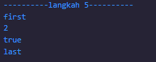

- dengan nama dan nim

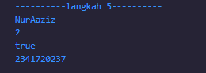

## 2. Jelaskan yang dimaksud Functions dalam bahasa Dart!

- Function dalam Dart adalah blok kode yang dapat dipanggil berulang-ulang dengan nama dan tugas tertentu, dan dapat menerima parameter serta mengembalikan nilai.

```dart
void sayHello(String name) {
  print('Hello $name');
}

void main() {
  sayHello('Nur Aziz');
}
```

## 3. Jelaskan jenis-jenis parameter di Functions beserta contoh sintaksnya!

- 1. Positional Parameter (Wajib diisi sesuai urutan)

```dart
void greet(String name, int age) {
  print("Hello $name, umur kamu $age tahun");
}

void main() {
  greet("aziz", 22); // harus urut
}
```

- 2. Optional Positional Parameter (ditandai dengan [])

```dart
void greet(String name, [int? age]) {
  print("Hello $name, umur: ${age ?? "tidak diketahui"}");
}

void main() {
  greet("aziz");       // tanpa age
  greet("aziz", 22);   // dengan age
}
```

- 3. Named Parameter (pakai {} dan biasanya diberi required)

```dart
void greet({required String name, int? age}) {
  print("Hello $name, umur: ${age ?? "tidak diketahui"}");
}

void main() {
  greet(name: "aziz", age: 22);
  greet(name: "aziz"); // age opsional
}
```

- 4. Default Parameter Value

```dart
void greet({String name = "Anonim", int age = 0}) {
  print("Hello $name, umur $age tahun");
}

void main() {
  greet(); // Hello Anonim, umur 0 tahun
  greet(name: "Stephen", age: 22);
}
```

## 4. Jelaskan maksud Functions sebagai first-class objects beserta contoh sintaknya!

- Function di Dart diperlakukan sama seperti data lain (String, int, dsb) yang berarti:
- disimpan di variabel
- dikirim sebagai parameter
- dikembalikan dari function lain.

```dart
void sayHello(String name) {
  print("Hello $name");
}

void main() {
  // simpan function ke variabel
  var greet = sayHello;
  greet("Stephen"); // Hello Stephen

  // kirim function ke parameter
  void execute(Function f) {
    f("Aziz");
  }

  execute(sayHello); // Hello Aziz
}
```

## 5. Apa itu Anonymous Functions? Jelaskan dan berikan contohnya!

- Function tanpa nama (biasanya dipakai cepat, sekali jalan).

```dart
void main() {
  // Anonymous function langsung dipanggil
  var numbers = [1, 2, 3];

  numbers.forEach((n) {
    print(n * 2); // 2, 4, 6
  });

  // Versi arrow function
  numbers.forEach((n) => print(n * n)); // 1, 4, 9
}

```

## 6. Jelaskan perbedaan Lexical scope dan Lexical closures! Berikan contohnya!

- Lexical Scope
- Scope ditentukan dari posisi kode (bukan runtime).
- Function hanya bisa akses variabel yang ada di dalam scope-nya.

```dart
void main() {
  var a = 10;

  void printA() {
    print(a); // bisa akses 'a' karena dalam lexical scope
  }

  printA(); // 10
}

```

- Lexical Closures
- Closure = function menyimpan dan “membawa” variabel dari scope luar, meski scope asal sudah selesai.

```dart
Function makeCounter() {
  var count = 0;

  return () {
    count++;
    return count;
  };
}

void main() {
  var counter = makeCounter();

  print(counter()); // 1
  print(counter()); // 2
  print(counter()); // 3
}

```

## 7. Jelaskan dengan contoh cara membuat return multiple value di Functions!

- Pakai List

```dart
List<int> getCoordinates() {
  return [10, 20];
}

void main() {
  var coords = getCoordinates();
  print("x=${coords[0]}, y=${coords[1]}"); // x=10, y=20
}

```

- Pakai Map

```dart
Map<String, int> getCoordinates() {
  return {"x": 10, "y": 20};
}

void main() {
  var coords = getCoordinates();
  print("x=${coords['x']}, y=${coords['y']}"); // x=10, y=20
}

```
