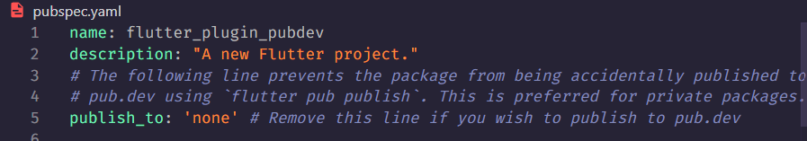
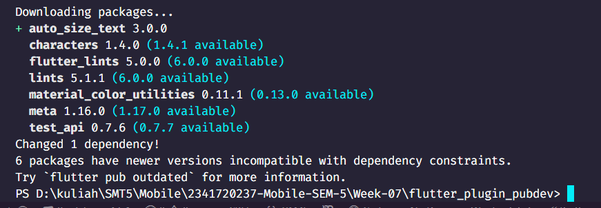
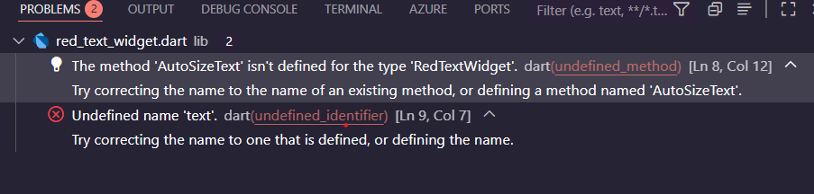
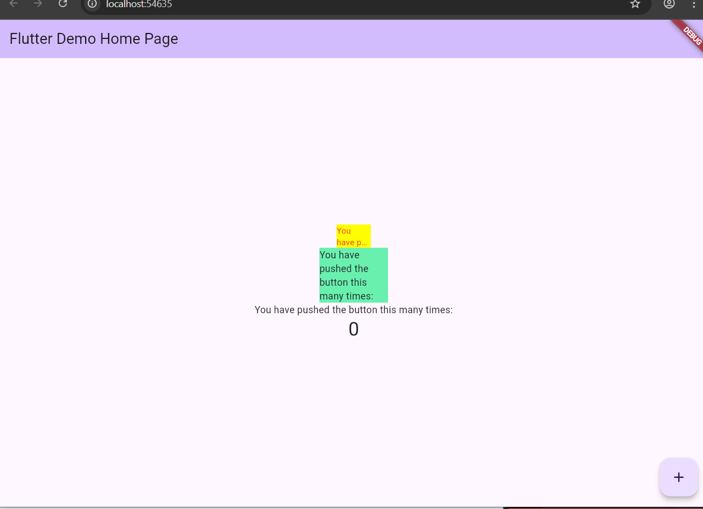

# Tugas Praktikum

## 1. Selesaikan Praktikum tersebut, lalu dokumentasikan dan push ke repository Anda berupa screenshot hasil pekerjaan beserta penjelasannya di file README.md!

### Langkah 1: Buat Project Baru

Buatlah sebuah project flutter baru dengan nama flutter_plugin_pubdev. Lalu jadikan repository di GitHub Anda dengan nama flutter_plugin_pubdev.



### Langkah 2: Menambahkan Plugin

Tambahkan plugin auto_size_text menggunakan perintah berikut di terminal



### Langkah 3: Buat file red_text_widget.dart

Buat file baru bernama red_text_widget.dart di dalam folder lib lalu isi kode seperti berikut.

```dart
import 'package:flutter/material.dart';

class RedTextWidget extends StatelessWidget {
  const RedTextWidget({super.key});

  @override
  Widget build(BuildContext context) {
    return Container();
  }
}
```

### Langkah 4: Tambah Widget AutoSizeText

Masih di file red_text_widget.dart, untuk menggunakan plugin auto_size_text, ubahlah kode return Container() menjadi seperti berikut.

```dart
return AutoSizeText(
      text,
      style: const TextStyle(color: Colors.red, fontSize: 14),
      maxLines: 2,
      overflow: TextOverflow.ellipsis,
);
```

Setelah Anda menambahkan kode di atas, Anda akan mendapatkan info error. Mengapa demikian? Jelaskan dalam laporan praktikum Anda!

### Terjadi error setelah menambahkan kode AutoSizeText, karena:



1. The method AutoSizeText isn't defined

- Penyebab: Plugin AutoSizeText belum diimport

2. Undefined name text

- Penyebab: Variabel text tidak didefinisikan dalam widget ini

Kode yang ditambahkan:

```dart
  final String text;
  const RedTextWidget({super.key, required this.text});
```

### Langkah 5: Buat Variabel text dan parameter di constructor

Tambahkan variabel text dan parameter di constructor seperti berikut.

```dart
final String text;
const RedTextWidget({Key? key, required this.text}) : super(key: key);
```

### Langkah 6: Tambahkan widget di main.dart

Buka file main.dart lalu tambahkan di dalam children: pada class \_MyHomePageState

```dart
Container(
   color: Colors.yellowAccent,
   width: 50,
   child: const RedTextWidget(
             text: 'You have pushed the button this many times:',
          ),
),
Container(
    color: Colors.greenAccent,
    width: 100,
    child: const Text(
           'You have pushed the button this many times:',
          ),
),
```

Hasil:\


## 2. Jelaskan maksud dari langkah 2 pada praktikum tersebut!

Perintah "flutter pub add auto_size_text" digunakan untuk secara otomatis mengunduh dan menambahkan package plugin bernama"auto_size_text" ke dalam proyek Flutter.

## 3. Jelaskan maksud dari langkah 5 pada praktikum tersebut!

Baris kode tersebut digunakan untuk menambahkan properti text bertipe String ke dalam widget "RedTextWidget" tersebut agar bisa menerima teks dari luar atau dari parent widget, sehingga widget tersebut dapat digunakan berkali-kali

## 4. Pada langkah 6 terdapat dua widget yang ditambahkan, jelaskan fungsi dan perbedaannya!

#### Widget Container Pertama Kuning

- Fungsi: Widget ini berfungsi untuk mendemonstrasikan kemampuan auto-sizing teks di dalam sebuah Container berwarna kuning dengan lebar 50 pixel. Menggunakan RedTextWidget, di dalam RedTextWidget terdapat AutoSizeText.
- Sehingga:
  - Ukuran font otomatis mengecil 
  - Teks dibatasi maksimal 2
  - Jika tidak muat, teks akan diakhiri dengan (...).
  - Warna teksnya adalah merah.

#### Widget Container Kedua Hijau

- Fungsi: Widget ini berfungsi untuk menampilkan teks yang sama di dalam sebuah Container berwarna hijau dengan lebar 100 pixel. Karena menggunakan widget Text standar:
  - Ukuran font default.
  - Teks akan otomatis ke baris baru jika tidak muat dalam satu baris.
  - Warna teksnya default.

## 5. Jelaskan maksud dari tiap parameter yang ada di dalam plugin auto_size_text berdasarkan tautan pada dokumentasi ini !

parameter-parameter AutoSizeText adalah:

- key - Key? - Identitas widget di widget tree.

- textKey - Key? - Key khusus untuk widget Text internal.

- style - TextStyle? - Gaya teks (font, warna, ukuran awal).

- minFontSize - double - Ukuran font terkecil yang diizinkan.

- maxFontSize - double - Ukuran font terbesar yang diizinkan.

- stepGranularity - double - Langkah perubahan ukuran font saat menyesuaikan teks.

- presetFontSizes - List<double>? - Daftar ukuran font yang boleh digunakan.

- group - AutoSizeGroup? - Menyamakan ukuran font beberapa AutoSizeText dalam satu grup.

- textAlign - TextAlign? - Perataan teks (kiri, kanan, tengah, dsb).

- textDirection - TextDirection? - Arah teks (LTR atau RTL).

- locale - Locale? - Menentukan aturan lokal (bahasa/font lokal).

- softWrap - bool? - Menentukan apakah teks boleh pindah baris.

- wrapWords - bool - Mengatur apakah kata boleh dipotong saat membungkus baris.

- overflow - TextOverflow? - Cara menangani teks yang meluap (ellipsis, clip, dll).

- overflowReplacement - Widget? - Widget pengganti bila teks tidak muat.

- textScaleFactor - double? - Faktor skala teks (biasanya dari pengaturan aksesibilitas).

- maxLines - int? - Jumlah maksimum baris teks.

- semanticsLabel - String? - Label alternatif untuk pembaca layar (aksesibilitas).

## 6. Kumpulkan laporan praktikum Anda berupa link repository GitHub kepada dosen!
