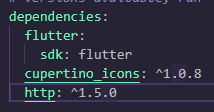
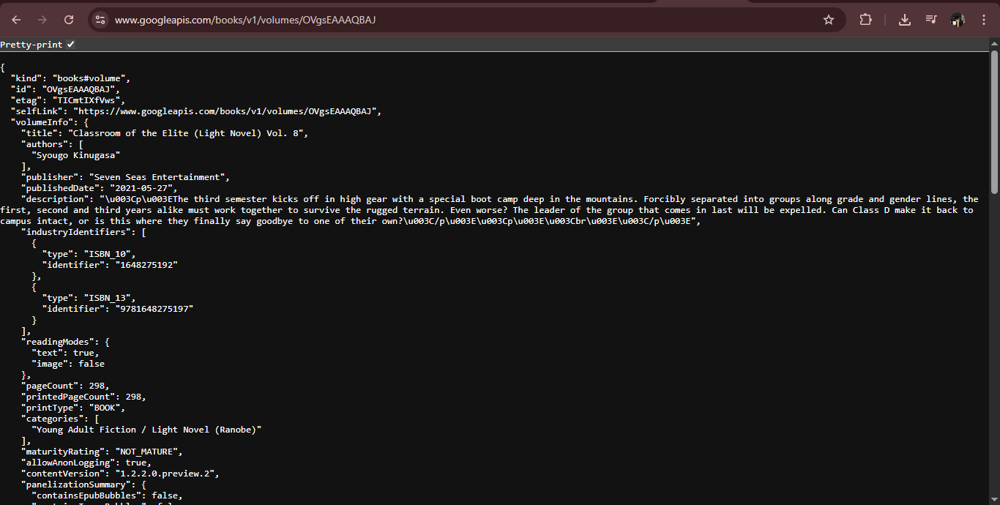
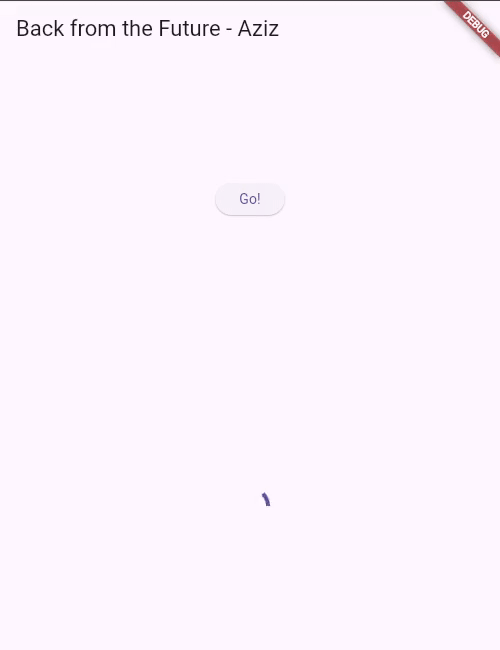

# Praktikum 1: Mengunduh Data dari Web Service (API)

## Langkah 1: Buat Project Baru

Buatlah sebuah project flutter baru dengan nama books di folder src week-11 repository GitHub Anda.
Kemudian Tambahkan dependensi http dengan mengetik perintah berikut di terminal.

`flutter pub add http`

## Langkah 2: Cek file pubspec.yaml

Jika berhasil install plugin, pastikan plugin http telah ada di file pubspec ini seperti berikut.
`dependencies:
  flutter:
    sdk: flutter
  http: ^1.1.0`



## Langkah 3: Buka file main.dart

### Soal 1

Tambahkan nama panggilan Anda pada title app sebagai identitas hasil pekerjaan Anda.

Ketiklah kode seperti berikut ini.

```dart
import 'package:flutter/material.dart';

void main() {
  runApp(const MyApp());
}

class MyApp extends StatelessWidget {
  const MyApp({super.key});

  @override
  Widget build(BuildContext context) {
    return MaterialApp(
      title: 'Praktikum Aziz',
      theme: ThemeData(
        primarySwatch: Colors.blue,
        visualDensity: VisualDensity.adaptivePlatformDensity,
      ),
      home: const FuturePage(),
    );
  }
}

class FuturePage extends StatefulWidget {
  const FuturePage({super.key});

  @override
  State<FuturePage> createState() => _FuturePageState();
}

class _FuturePageState extends State<FuturePage> {
  String result = '';
  @override
  Widget build(BuildContext context) {
    return Scaffold(
      appBar: AppBar(title: const Text('Back from the Future - Aziz')),
      body: Center(
        child: Column(
          children: [
            const Spacer(),
            ElevatedButton(onPressed: () {}, child: Text('Go!')),
            const Spacer(),
            Text(result),
            const Spacer(),
            const CircularProgressIndicator(),
            const Spacer(),
          ],
        ),
      ),
    );
  }
}
```

## Langkah 4: Tambah method getData()

Tambahkan method ini ke dalam class \_FuturePageState yang berguna untuk mengambil data dari API Google Books.

```dart
Future<Response> getData() async {
  const authority = 'www.googleapis.com';
  const path = '/books/v1/volumes/OVgsEAAAQBAJ';
  Uri url = Uri.https(authority, path);
  return http.get(url);
}
```

### Soal 2

- Carilah judul buku favorit Anda di Google Books, lalu ganti ID buku pada variabel path di kode tersebut. Caranya ambil di URL browser Anda seperti gambar berikut ini.
- Kemudian cobalah akses di browser URI tersebut dengan lengkap seperti ini. Jika menampilkan data JSON, maka Anda telah berhasil. Lakukan capture milik Anda dan tulis di README pada laporan praktikum. Lalu lakukan commit dengan pesan "W11: Soal 2"
- Link: https://www.google.co.id/books/edition/Classroom_of_the_Elite_Light_Novel_Vol_8/OVgsEAAAQBAJ?hl=en&gbpv=0
- Kode unik: OVgsEAAAQBAJ
  

## Langkah 5: Tambah kode di ElevatedButton

Tambahkan kode pada onPressed di ElevatedButton seperti berikut.

```dart
ElevatedButton(
  onPressed: () {
    setState(() {});
    getData()
        .then((value) {
          result = value.body.toString().substring(0, 450);
          setState(() {});
        })
        .catchError((_) {
          result = 'An error occurred';
          setState(() {});
        });
  },
  child: Text('Go!'),
),
```

Lakukan run aplikasi Flutter Anda. Anda akan melihat tampilan akhir seperti gambar berikut. Jika masih terdapat error, silakan diperbaiki hingga bisa running.

### Soal 3

- Jelaskan maksud kode langkah 5 tersebut terkait substring dan catchError!
- substring(0, 450)
Memotong string hasil value.body supaya 450 karakter pertama yang disimpan di variabel result. Tujuannya agar widget Text tidak menampilkan seluruh respons, melainkan hanya cuplikan singkat saja.
- catchError((_) { … })
Menangkap setiap kegagalan yang terjadi selama pemanggilan getData() Ketika ada error, result diisi string 'An error occurred' dan setState dipanggil untuk memperbarui tampilan.
- Capture hasil praktikum Anda berupa GIF dan lampirkan di README. Lalu lakukan commit dengan pesan "W11: Soal 3".
  
