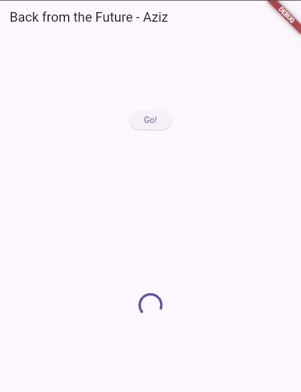
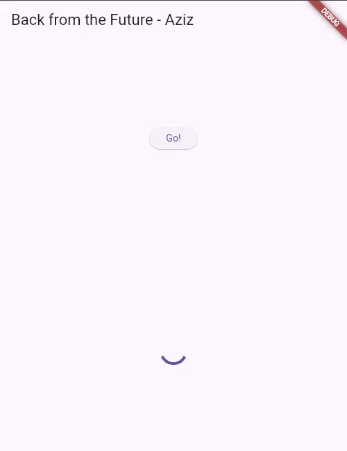
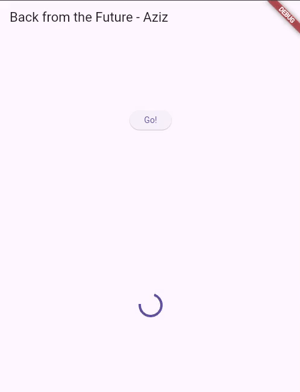
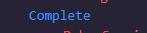
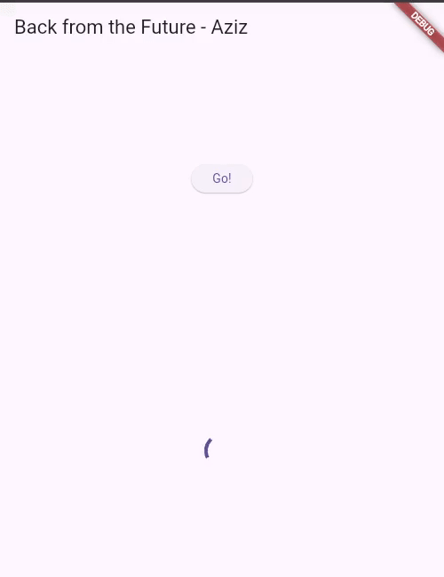
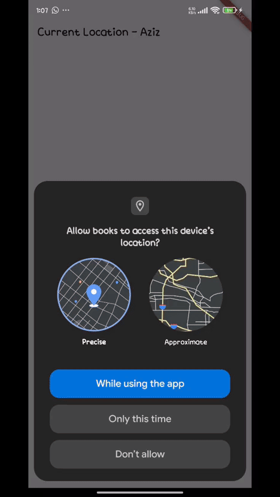
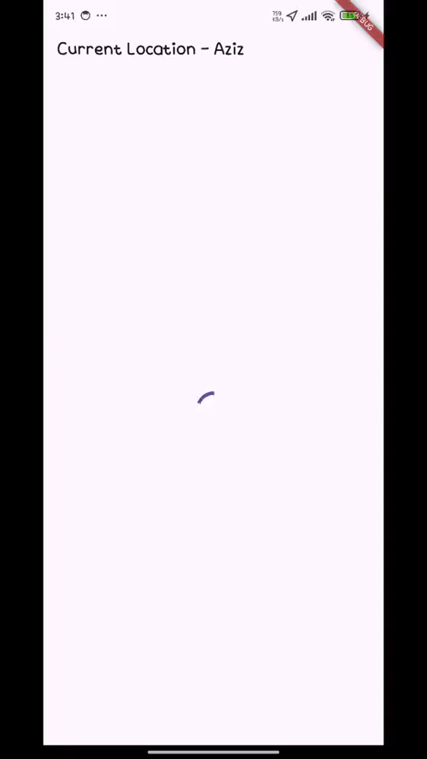
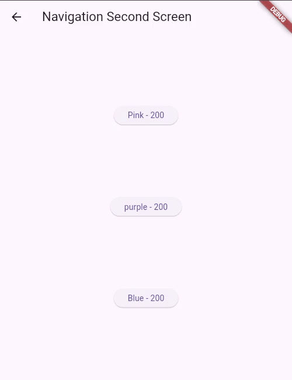
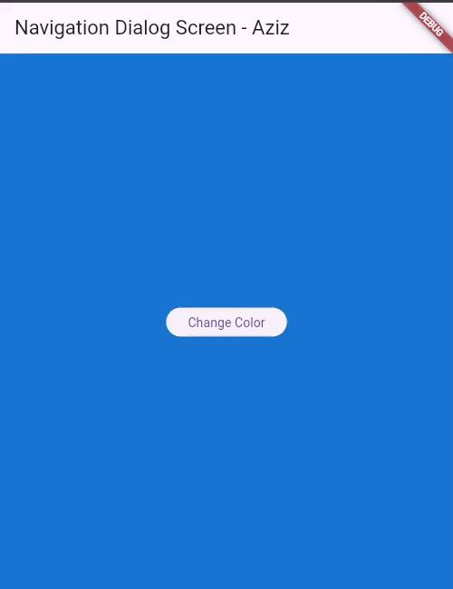

# Praktikum 1: Mengunduh Data dari Web Service (API)

## Langkah 1: Buat Project Baru

Buatlah sebuah project flutter baru dengan nama books di folder src week-11 repository GitHub Anda.
Kemudian Tambahkan dependensi http dengan mengetik perintah berikut di terminal.

`flutter pub add http`

## Langkah 2: Cek file pubspec.yaml

Jika berhasil install plugin, pastikan plugin http telah ada di file pubspec ini seperti berikut.
`dependencies:
  flutter:
    sdk: flutter
  http: ^1.1.0`


## Langkah 3: Buka file main.dart

### Soal 1

Tambahkan nama panggilan Anda pada title app sebagai identitas hasil pekerjaan Anda.

Ketiklah kode seperti berikut ini.

```dart
import 'package:flutter/material.dart';

void main() {
  runApp(const MyApp());
}

class MyApp extends StatelessWidget {
  const MyApp({super.key});

  @override
  Widget build(BuildContext context) {
    return MaterialApp(
      title: 'Praktikum Aziz',
      theme: ThemeData(
        primarySwatch: Colors.blue,
        visualDensity: VisualDensity.adaptivePlatformDensity,
      ),
      home: const FuturePage(),
    );
  }
}

class FuturePage extends StatefulWidget {
  const FuturePage({super.key});

  @override
  State<FuturePage> createState() => _FuturePageState();
}

class _FuturePageState extends State<FuturePage> {
  String result = '';
  @override
  Widget build(BuildContext context) {
    return Scaffold(
      appBar: AppBar(title: const Text('Back from the Future - Aziz')),
      body: Center(
        child: Column(
          children: [
            const Spacer(),
            ElevatedButton(onPressed: () {}, child: Text('Go!')),
            const Spacer(),
            Text(result),
            const Spacer(),
            const CircularProgressIndicator(),
            const Spacer(),
          ],
        ),
      ),
    );
  }
}
```

## Langkah 4: Tambah method getData()

Tambahkan method ini ke dalam class \_FuturePageState yang berguna untuk mengambil data dari API Google Books.

```dart
Future<Response> getData() async {
  const authority = 'www.googleapis.com';
  const path = '/books/v1/volumes/OVgsEAAAQBAJ';
  Uri url = Uri.https(authority, path);
  return http.get(url);
}
```

### Soal 2

- Carilah judul buku favorit Anda di Google Books, lalu ganti ID buku pada variabel path di kode tersebut. Caranya ambil di URL browser Anda seperti gambar berikut ini.
- Kemudian cobalah akses di browser URI tersebut dengan lengkap seperti ini. Jika menampilkan data JSON, maka Anda telah berhasil. Lakukan capture milik Anda dan tulis di README pada laporan praktikum. Lalu lakukan commit dengan pesan "W11: Soal 2"
- Link: https://www.google.co.id/books/edition/Classroom_of_the_Elite_Light_Novel_Vol_8/OVgsEAAAQBAJ?hl=en&gbpv=0
- Kode unik: OVgsEAAAQBAJ
  

## Langkah 5: Tambah kode di ElevatedButton

Tambahkan kode pada onPressed di ElevatedButton seperti berikut.

```dart
ElevatedButton(
  onPressed: () {
    setState(() {});
    getData()
        .then((value) {
          result = value.body.toString().substring(0, 450);
          setState(() {});
        })
        .catchError((_) {
          result = 'An error occurred';
          setState(() {});
        });
  },
  child: Text('Go!'),
),
```

Lakukan run aplikasi Flutter Anda. Anda akan melihat tampilan akhir seperti gambar berikut. Jika masih terdapat error, silakan diperbaiki hingga bisa running.

### Soal 3

- Jelaskan maksud kode langkah 5 tersebut terkait substring dan catchError!
- substring(0, 450)
  Memotong string hasil value.body supaya 450 karakter pertama yang disimpan di variabel result. Tujuannya agar widget Text tidak menampilkan seluruh respons, melainkan hanya cuplikan singkat saja.
- catchError((\_) { … })
  Menangkap setiap kegagalan yang terjadi selama pemanggilan getData() Ketika ada error, result diisi string 'An error occurred' dan setState dipanggil untuk memperbarui tampilan.
- Capture hasil praktikum Anda berupa GIF dan lampirkan di README. Lalu lakukan commit dengan pesan "W11: Soal 3".
  

# Praktikum 2: Menggunakan await/async untuk menghindari callbacks

## Langkah 1: Buka file main.dart

Tambahkan tiga method berisi kode seperti berikut di dalam class \_FuturePageState.

```dart
Future<int> returnOneAsync() async {
  await Future.delayed(const Duration(seconds: 3));
  return 1;
}

Future<int> returnTwoAsync() async {
  await Future.delayed(const Duration(seconds: 3));
  return 2;
}

Future<int> returnThreeAsync() async {
  await Future.delayed(const Duration(seconds: 3));
  return 3;
}
```

## Langkah 2: Tambah method count()

```dart
Future count() async {
  int total = 0;
  total = await returnOneAsync();
  total += await returnTwoAsync();
  total += await returnThreeAsync();
  setState(() {
    result = total.toString();
  });
}
```

Lalu tambahkan lagi method ini di bawah ketiga method sebelumnya.

## Langkah 3: Panggil count()

Lakukan comment kode sebelumnya, ubah isi kode onPressed() menjadi seperti berikut.

```dart
ElevatedButton(
  child: Text('Go!'),
      onPressed: () {
         count();
      }
)
```

## Langkah 4: Run

Akhirnya, run atau tekan F5 jika aplikasi belum running. Maka Anda akan melihat seperti gambar berikut, hasil angka 6 akan tampil setelah delay 9 detik.

## Soal 4

- Jelaskan maksud kode langkah 1 dan 2 tersebut!
  - Langkah 1 – membuat tiga method async Tujuannya hanya memberikan pekerjaan delay 3 detik yang nanti akan dijalankan secara berurutan.
    - Masing-masing method mengembalikan Future dengan nilai 1, 2, dan 3.
    - await Future.delayed(...) membuat prosesnya menunggu 3 detik sebelum mengembalikan angka tersebut, sehingga kita punya “task” yang bisa dipantau waktunya.
    - Langkah 2 – method count() Method ini menunjukkan pola urutan pada operasi async: - Mulai dengan total = 0. - Menunggu returnOneAsync() selesai 3 detik, ambil hasil 1 → total = 1. - Menunggu returnTwoAsync() selesai 3 detik, tambahkan 2 → total = 3. - Menunggu returnThreeAsync() selesai 3 detik, tambahkan 3 → total = 6. - Setelah ketiga tugas selesai (total 9 detik), baru memanggil setState untuk memperbarui UI dengan angka 6.
- Capture hasil praktikum Anda berupa GIF dan lampirkan di README. Lalu lakukan commit dengan pesan "W11: Soal 4".

  

# Praktikum 3: Menggunakan Completer di Future

## Langkah 1: Buka main.dart

Pastikan telah impor package async berikut.

```dart
import 'package:async/async.dart';
```

## Langkah 2: Tambahkan variabel dan method

Tambahkan variabel late dan method di class \_FuturePageState seperti ini.

```dart
late Completer completer;

Future getNumber() {
  completer = Completer<int>();
  calculate();
  return completer.future;
}

Future calculate() async {
  await Future.delayed(const Duration(seconds: 5));
  completer.complete(42);
}
```

## Langkah 3: Ganti isi kode onPressed()

Tambahkan kode berikut pada fungsi onPressed(). Kode sebelumnya bisa Anda comment.

```dart
getNumber().then((value) {
  setState(() {
    result = value.toString();
  });
});
```

## Langkah 4:

Terakhir, run atau tekan F5 untuk melihat hasilnya jika memang belum running. Bisa juga lakukan hot restart jika aplikasi sudah running. Maka hasilnya akan seperti gambar berikut ini. Setelah 5 detik, maka angka 42 akan tampil.



### Soal 5

- Jelaskan maksud kode langkah 2 tersebut!
  - late Completer completer; Menyediakan tempat yang nanti akan men-complete sebuah Future.
  - getNumber()
    Membuat instance Completer baru. Langsung memanggil calculate() (tanpa await), jadi tidak menunggu 5 detik. Langsung mengembalikan completer.future ke pemanggil. Pemanggil langsung mendapat Future yang belum selesai; nilai akan datang nanti.
  - calculate()
    Menunggu 5 detik. kemudian memanggil completer.complete(42). Saat itulah Future yang dikembalikan getNumber() selesai dengan nilai 42.

Capture hasil praktikum Anda berupa GIF dan lampirkan di README. Lalu lakukan commit dengan pesan "W11: Soal 5".

## Langkah 5: Ganti method calculate()

Gantilah isi code method calculate() seperti kode berikut, atau Anda dapat membuat calculate2()

```dart
Future calculate() async {
  try {
    await Future.delayed(const Duration(seconds: 5));
    completer.complete(42);
  } catch (e) {
    completer.completeError(e);
  }
}
```

## Langkah 6: Pindah ke onPressed()

Ganti menjadi kode seperti berikut.

```dart
getNumber()
.then((value) {
  setState(() {
    result = value.toString();
  });
})
.catchError((e) {
  result = 'An error occurred';
});
```

### Soal 6

- Jelaskan maksud perbedaan kode langkah 2 dengan langkah 5-6 tersebut!
  - Perbedaanya pada kode langkah 5-6 adalah dapat menghandle jika terjadi error udah
- Capture hasil praktikum Anda berupa GIF dan lampirkan di README. Lalu lakukan commit dengan pesan "W11: Soal 6".


# Praktikum 4: Memanggil Future secara paralel

FutureGroup tersedia di package async, yang mana itu harus diimpor ke file dart Anda, seperti berikut.

`import 'package:async/async.dart';`

## Langkah 1: Buka file main.dart

Tambahkan method ini ke dalam class \_FuturePageState

```dart
Future returnFG() async {
  FutureGroup<int> futureGroup = FutureGroup<int>();
  futureGroup.add(returnOneAsync());
  futureGroup.add(returnTwoAsync());
  futureGroup.add(returnThreeAsync());
  futureGroup.close();
  final futures = await futureGroup.future;
  int total = 0;
  for (var num in futures) {
    total += num;
  }
  setState(() {
    result = total.toString();
  });
}
```

## Langkah 2: Edit onPressed()

Anda bisa hapus atau comment kode sebelumnya, kemudian panggil method dari langkah 1 tersebut.

```dart
ElevatedButton(
            onPressed: () {
              returnFG();
              // getNumber()
```

## Langkah 3: Run

Anda akan melihat hasilnya dalam 3 detik berupa angka 6 lebih cepat dibandingkan praktikum sebelumnya menunggu sampai 9 detik.

### Soal 7

Capture hasil praktikum Anda berupa GIF dan lampirkan di README. Lalu lakukan commit dengan pesan "W11: Soal 7".


## Langkah 4: Ganti variabel futureGroup

Anda dapat menggunakan FutureGroup dengan Future.wait seperti kode berikut.

```dart
final futures = Future.wait<int>([
  returnOneAsync(),
  returnTwoAsync(),
  returnThreeAsync(),
]);
```

### Soal 8

Jelaskan maksud perbedaan kode langkah 1 dan 4!

- Future.wait: digunakan jika sudah tahu semua Future sejak awal, dan ingin cara yang lebih ringkas dan efisien.
- FutureGroup: digunakan untuk mengelola Future secara dinamis (misalnya dalam loop atau kondisi tertentu).

# Praktikum 5: Menangani Respon Error pada Async Code

## Langkah 1: Buka file main.dart

Tambahkan method ini ke dalam class \_FuturePageState

```dart
Future<int> returnError() async {
  await Future.delayed(const Duration(seconds: 2));
  throw Exception('Something terrible happened!');
}
```

## Langkah 2: ElevatedButton

Ganti dengan kode berikut

```dart
returnError()
    .then((value) {
      setState(() {
        result = 'Success';
      });
    })
    .catchError((onError) {
      setState(() {
        result = onError.toString();
      });
    })
    .whenComplete(() => print('Complete'));
```

## Langkah 3: Run

Lakukan run dan klik tombol GO! maka akan menghasilkan seperti gambar berikut.
Pada bagian debug console akan melihat teks Complete seperti berikut.



### Soal 9

- Capture hasil praktikum Anda berupa GIF dan lampirkan di README. Lalu lakukan commit dengan pesan "W11: Soal 9".
  

## Langkah 4: Tambah method handleError()

Tambahkan kode ini di dalam class \_FutureStatePage

```dart
Future handleError() async {
    try {
      await returnError();
    } catch (e) {
      setState(() {
        result = e.toString();
      });
    } finally {
      print('complete');
    }
  }
```

### Soal 10

- Panggil method handleError() tersebut di ElevatedButton, lalu run. Apa hasilnya? Jelaskan perbedaan kode langkah 1 dan 4!
  - Hasil langkah 4 dengan langkah satu sama saja hanya berbeda cara, yang membedakan hanyalah langkah 4 menambahkan method handlerError() kemudian dipanggil pada elevated.


# Praktikum 6: Menggunakan Future dengan StatefulWidget

## Langkah 1: install plugin geolocator

Tambahkan plugin geolocator dengan mengetik perintah berikut di terminal.

`flutter pub add geolocator`

## Langkah 2: Tambah permission GPS

Jika Anda menargetkan untuk platform Android, maka tambahkan baris kode berikut di file android/app/src/main/androidmanifest.xml

`<uses-permission android:name="android.permission.ACCESS_FINE_LOCATION"/>
<uses-permission android:name="android.permission.ACCESS_COARSE_LOCATION"/>`

## Langkah 3: Buat file geolocation.dart

Tambahkan file baru ini di folder lib project Anda.

## Langkah 4: Buat StatefulWidget

Buat class LocationScreen di dalam file geolocation.dart

## Langkah 5: Isi kode geolocation.dart

### Soal 11

- Tambahkan nama panggilan Anda pada tiap properti title sebagai identitas pekerjaan Anda.

```dart
import 'package:flutter/material.dart';
import 'package:geolocator/geolocator.dart';

class LocationScreen extends StatefulWidget {
  const LocationScreen({super.key});

  @override
  State<LocationScreen> createState() => _LocationScreenState();
}

class _LocationScreenState extends State<LocationScreen> {
  String myPosition = "";

  @override
  void initState() {
    super.initState();
    getPosition().then((Position myPos) {
      myPosition =
          'latitude: ${myPos.latitude.toString()} - Longitude: ${myPos.longitude.toString()}';
      setState(() {
        myPosition = myPosition;
      });
    });
  }

  @override
  Widget build(BuildContext context) {
    return Scaffold(
      appBar: AppBar(title: const Text('Current Location - Aziz')),
      body: Center(child: Text(myPosition)),
    );
  }

  Future<Position> getPosition() async {
    await Geolocator.requestPermission();
    await Geolocator.isLocationServiceEnabled();
    Position? position = await Geolocator.getCurrentPosition();
    return position;
  }
}
```

## Langkah 6: Edit main.dart

Panggil screen baru tersebut di file main Anda seperti berikut.

```dart
home: LocationScreen(),
```

## Langkah 7: Run

Run project Anda di device atau emulator (bukan browser), maka akan tampil seperti berikut ini.



## Langkah 8: Tambahkan animasi loading

Tambahkan widget loading seperti kode berikut. Lalu hot restart, perhatikan perubahannya.

```dart
Widget build(BuildContext context) {
    final myWidget = myPosition == ''
        ? const CircularProgressIndicator()
        : Text(myPosition);
    return Scaffold(
      appBar: AppBar(title: const Text('Current Location - Aziz')),
      body: Center(child: myWidget),
    );
  }
```

### Soal 12

- Jika Anda tidak melihat animasi loading tampil, kemungkinan itu berjalan sangat cepat. Tambahkan delay pada method getPosition() dengan kode await Future.delayed(const Duration(seconds: 3));

```dart
Future<Position> getPosition() async {
  await Geolocator.requestPermission();
  await Geolocator.isLocationServiceEnabled();
  await Future.delayed(const Duration(seconds: 2));
  Position? position = await Geolocator.getCurrentPosition();
  return position;
}
```

- Apakah Anda mendapatkan koordinat GPS ketika run di browser? Mengapa demikian?
  - ya, saya mendapatkan koordinat gps ketika dirun dichrome
- Capture hasil praktikum Anda berupa GIF dan lampirkan di README. Lalu lakukan commit dengan pesan "W11: Soal 12".


# Praktikum 7: Manajemen Future dengan FutureBuilder

## Langkah 1: Modifikasi method getPosition()

Buka file geolocation.dart kemudian ganti isi method dengan kode ini.

```dart
Future<Position> getPosition() async {
  await Geolocator.requestPermission();
  await Geolocator.isLocationServiceEnabled();
  await Future.delayed(const Duration(seconds: 1));
  Position? position = await Geolocator.getCurrentPosition();
  return position;
}
```

## Langkah 2: Tambah variabel

Tambah variabel ini di class \_LocationScreenState

`Future<Position>? position;`

## Langkah 3: Tambah initState()

Tambah method ini dan set variabel position

```dart
@override
void initState() {
  super.initState();
  position = getPosition();
}
```

## Langkah 4: Edit method build()

Ketik kode berikut dan sesuaikan. Kode lama bisa Anda comment atau hapus.

```dart
@override
Widget build(BuildContext context) {
  return Scaffold(
    appBar: AppBar(title: Text('Current Location - Aziz')),
    body: Center(
      child: FutureBuilder<Position>(
        future: position,
        builder: (BuildContext context, AsyncSnapshot<Position> snapshot) {
          if (snapshot.connectionState == ConnectionState.waiting) {
            return const CircularProgressIndicator();
          } else if (snapshot.connectionState == ConnectionState.done) {
            return Text(snapshot.data.toString());
          } else if (snapshot.hasError) {
            return Text('Error: ${snapshot.error}');
          } else {
            return const Text('');
          }
        },
      ),
    ),
  );
}
```

### Soal 13

- Apakah ada perbedaan UI dengan praktikum sebelumnya? Mengapa demikian?
  - tidak ada bedanya pada bagian UI
- Capture hasil praktikum Anda berupa GIF dan lampirkan di README. Lalu lakukan commit dengan pesan "W11: Soal 13".



- Seperti yang Anda lihat, menggunakan FutureBuilder lebih efisien, clean, dan reactive dengan Future bersama UI.

## Langkah 5: Tambah handling error

Tambahkan kode berikut untuk menangani ketika terjadi error. Kemudian hot restart.

```dart
...
} else if (snapshot.hasError) {
  return Text('Error: ${snapshot.error}');
} else {
...
```

### Soal 14

- Apakah ada perbedaan UI dengan langkah sebelumnya? Mengapa demikian?
  - tidak ada bedanya dari UI, hanya ditambahkan handling error
- Capture hasil praktikum Anda berupa GIF dan lampirkan di README. Lalu lakukan commit dengan pesan "W11: Soal 14".


# Praktikum 8: Navigation route dengan Future Function

## Langkah 1: Buat file baru navigation_first.dart

Buatlah file baru ini di project lib Anda.

## Langkah 2: Isi kode navigation_first.dart

### Soal 15

- Tambahkan nama panggilan Anda pada tiap properti title sebagai identitas pekerjaan Anda.
- Silakan ganti dengan warna tema favorit Anda.

```dart
import 'package:books/navigation_second.dart';
import 'package:flutter/material.dart';

class NavigationFirst extends StatefulWidget {
  const NavigationFirst({super.key});

  @override
  State<NavigationFirst> createState() => _NavigationFirstState();
}

class _NavigationFirstState extends State<NavigationFirst> {
  Color color = Colors.blue.shade700;

  @override
  Widget build(BuildContext context) {
    return Scaffold(
      backgroundColor: color,
      appBar: AppBar(title: const Text('Navigation First Screen - Aziz')),
      body: Center(
        child: ElevatedButton(
          child: const Text('Change Color'),
          onPressed: () {
            _navigateAndGetColor(context);
          },
        ),
      ),
    );
  }
}
```

## Langkah 3: Tambah method di class \_NavigationFirstState

Tambahkan method ini.

## Langkah 4: Buat file baru navigation_second.dart

Buat file baru ini di project lib Anda. Silakan jika ingin mengelompokkan view menjadi satu folder dan sesuaikan impor yang dibutuhkan.

## Langkah 5: Buat class NavigationSecond dengan StatefulWidget

```dart
import 'package:flutter/material.dart';

class NavigationSecond extends StatefulWidget {
  const NavigationSecond({super.key});

  @override
  State<NavigationSecond> createState() => _NavigationSecondState();
}

class _NavigationSecondState extends State<NavigationSecond> {
  @override
  Widget build(BuildContext context) {
    Color color;
    return Scaffold(
      appBar: AppBar(title: const Text('Navigation Second Screen')),
      body: Center(
        child: Column(
          mainAxisAlignment: MainAxisAlignment.spaceEvenly,
          children: [
            ElevatedButton(
              child: const Text('Pink - 200'),
              onPressed: () {
                color = Colors.pink.shade200;
                Navigator.pop(context, color);
              },
            ),
            ElevatedButton(
              child: const Text('purple - 200'),
              onPressed: () {
                color = Colors.purple.shade200;
                Navigator.pop(context, color);
              },
            ),
            ElevatedButton(
              child: const Text('Blue - 200'),
              onPressed: () {
                color = Colors.blue.shade200;
                Navigator.pop(context, color);
              },
            ),
          ],
        ),
      ),
    );
  }
}
```

## Langkah 6: Edit main.dart

Lakukan edit properti home.

`home: const NavigationFirst(),`

### Soal 16

- Cobalah klik setiap button, apa yang terjadi ? Mengapa demikian ?
  - Saat menekan tombol 'Change Color' (Halaman 1): Aplikasi berpindah dari Halaman 1 (NavigationFirst) ke Halaman 2 (NavigationSecond).
  - Saat menekan salah satu tombol warna (misal 'pink') (Halaman 2): Aplikasi kembali ke Halaman 1, dan warna latar belakang Halaman 1 berubah menjadi warna yang dipilih.
- Gantilah 3 warna pada langkah 5 dengan warna favorit Anda!
  - Colors.pink.shade200
  - Colors.purple.shade200
  - Colors.blue.shade200
- Capture hasil praktikum Anda berupa GIF dan lampirkan di README. Lalu lakukan commit dengan pesan "W11: Soal 16".



# Praktikum 9: Memanfaatkan async/await dengan Widget Dialog

## Langkah 1: Buat file baru navigation_dialog.dart

Buat file dart baru di folder lib project Anda.

## Langkah 2: Isi kode navigation_dialog.dart

```dart
import 'package:flutter/material.dart';

class NavigationDialogScreen extends StatefulWidget {
  const NavigationDialogScreen({super.key});

  @override
  State<NavigationDialogScreen> createState() => _NavigationDialogScreenState();
}

class _NavigationDialogScreenState extends State<NavigationDialogScreen> {
  Color color = Colors.blue.shade700;

  @override
  Widget build(BuildContext context) {
    return Scaffold(
      backgroundColor: color,
      appBar: AppBar(title: const Text('Navigation Dialog Screen - Aziz')),
      body: Center(
        child: ElevatedButton(
          child: const Text('Change Color'),
          onPressed: () {},
        ),
      ),
    );
  }
}
```

## Langkah 3: Tambah method async

```dart
showColorDialog(BuildContext context) async {
    await showDialog(
      barrierDismissible: false,
      context: context,
      builder: (_) {
        return AlertDialog(
          title: const Text('Very important question'),
          content: const Text('Please choose a color'),
          actions: <Widget>[
            TextButton(
              child: const Text('Pink - 200'),
              onPressed: () {
                color = Colors.pink.shade200;
                Navigator.pop(context, color);
              },
            ),
            TextButton(
              child: const Text('purple - 200'),
              onPressed: () {
                color = Colors.purple.shade200;
                Navigator.pop(context, color);
              },
            ),
            TextButton(
              child: const Text('Blue - 200'),
              onPressed: () {
                color = Colors.blue.shade200;
                Navigator.pop(context, color);
              },
            ),
          ],
        );
      },
    );
  }
```

## Langkah 4: Panggil method di ElevatedButton

```dart
onPressed: () {
  _showColorDialog(context).then((value) => setState(() {}));
},
```

## Langkah 5: Edit main.dart

Ubah properti home

`home: const NavigationDialogScreen(),`

## Langkah 6: Run

Coba ganti warna background dengan widget dialog tersebut. Jika terjadi error, silakan diperbaiki. Jika berhasil, akan tampil seperti gambar berikut.

### Soal 17

- Cobalah klik setiap button, apa yang terjadi ? Mengapa demikian ?
  - Saat menekan tombol 'Change Color': Sebuah AlertDialog (pop-up) muncul di atas halaman.
  - Saat menekan salah satu pilihan warna misal 'pink': Dialog tertutup, dan warna latar belakang halaman berubah menjadi warna yang dipilih.
- Gantilah 3 warna pada langkah 3 dengan warna favorit Anda!
  - Colors.pink.shade200
  - Colors.purple.shade200
  - Colors.blue.shade200
- Capture hasil praktikum Anda berupa GIF dan lampirkan di README. Lalu lakukan commit dengan pesan "W11: Soal 17".

