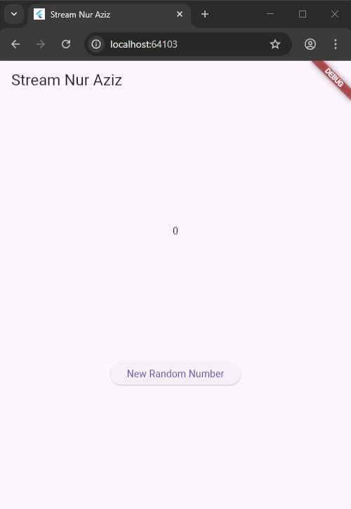
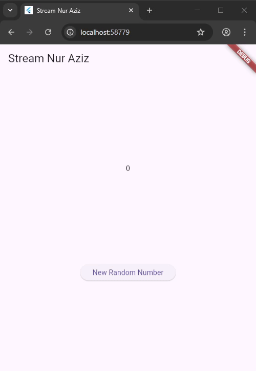
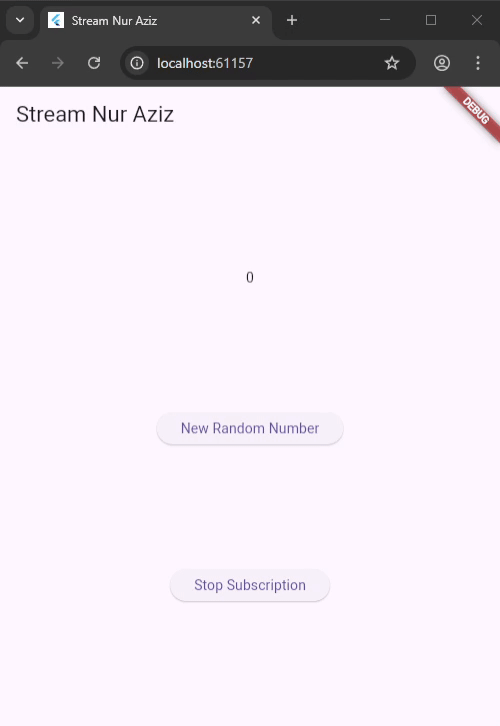
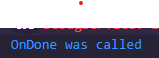
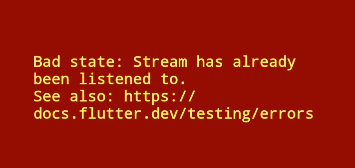
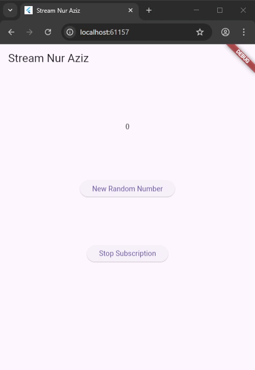
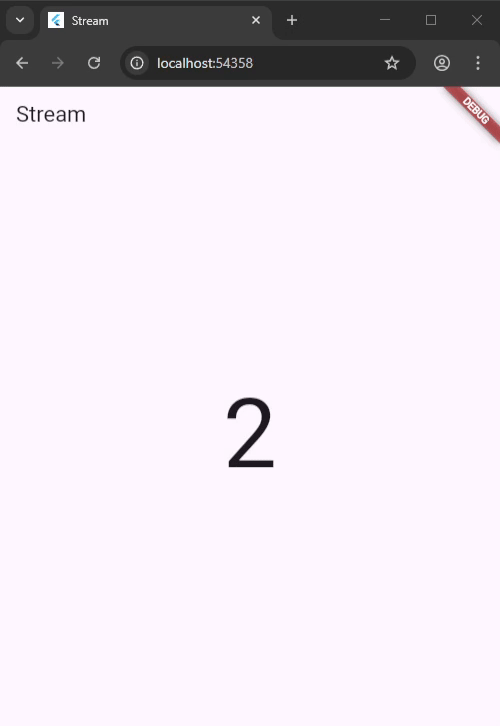

# Praktikum 1: Dart Streams

Selesaikan langkah-langkah praktikum berikut ini menggunakan editor Visual Studio Code (VS Code) atau Android Studio atau code editor lain kesukaan Anda. Jawablah di laporan praktikum Anda (ketik di README.md) pada setiap soal yang ada di beberapa langkah praktikum ini.

# Langkah 1: Buat Project Baru

Buatlah sebuah project flutter baru dengan nama stream_nama (beri nama panggilan Anda) di folder week-12/src/ repository GitHub Anda.

# Langkah 2: Buka file main.dart

Ketiklah kode seperti berikut ini.

```dart
import 'package:flutter/material.dart';

void main() {
  runApp(const MyApp());
}

class MyApp extends StatelessWidget {
  const MyApp({super.key});

  @override
  Widget build(BuildContext context) {
    return MaterialApp(
      title: 'Stream',
      theme: ThemeData(
        primarySwatch: Colors.deepPurple,
      ),
      home: const StreamHomePage(),
    );
  }
}

class StreamHomePage extends StatefulWidget {
  const StreamHomePage({super.key});

  @override
  State<StreamHomePage> createState() => _StreamHomePageState();
}
```

```dart
class _StreamHomePageState extends State<StreamHomePage> {
  @override
  Widget build(BuildContext context) {
    return Container();
  }
}
```

## Soal 1

Tambahkan nama panggilan Anda pada title app sebagai identitas hasil pekerjaan Anda.

```dart
  @override
  Widget build(BuildContext context) {
    return MaterialApp(
      title: 'Stream Nur Aziz',
```

Gantilah warna tema aplikasi sesuai kesukaan Anda.
Lakukan commit hasil jawaban Soal 1 dengan pesan "W12: Jawaban Soal 1"

```dart
primarySwatch: Colors.lightblue,
```

# Langkah 3: Buat file baru stream.dart

Buat file baru di folder lib project Anda. Lalu isi dengan kode berikut.

```dart
import 'package:flutter/material.dart';

class ColorStream {

}
```

# Langkah 4: Tambah variabel colors

Tambahkan variabel di dalam class ColorStream seperti berikut.

```dart
  final List<Color> colors = [
    Colors.blueGrey,
    Colors.amber,
    Colors.deepPurple,
    Colors.lightBlue,
    Colors.teal,
  ];
```

## Soal 2

### Tambahkan 5 warna lainnya sesuai keinginan Anda pada variabel colors tersebut.

```dart
  final List<Color> colors = [
    Colors.blueGrey,
    Colors.amber,
    Colors.deepPurple,
    Colors.lightBlue,
    Colors.teal,
    // Soal 2: Menambahkan warna sesuai keinginan
    Colors.pink,
    Colors.orange,
    Colors.green,
    Colors.red,
    Colors.indigo,
  ];
```

### Lakukan commit hasil jawaban Soal 2 dengan pesan "W12: Jawaban Soal 2"

# Langkah 5: Tambah method getColors()

Di dalam class ColorStream ketik method seperti kode berikut. Perhatikan tanda bintang di akhir keyword async\* (ini digunakan untuk melakukan Stream data)

```dart
Stream<Color> getColors() async* {
}
```

# Langkah 6: Tambah perintah yield\*

Tambahkan kode berikut ini.

```dart
yield* Stream.periodic(
  const Duration(seconds: 1), (int t) {
    int index = t % colors.length;
    return colors[index];
});
```

## Soal 3

### Jelaskan fungsi keyword yield\* pada kode tersebut!

Kata kunci yield* digunakan untuk meneruskan semua data dari Stream lain ke Stream yang sedang dibuat. Jika yield hanya mengirim satu nilai, maka yield* mengirim seluruh aliran data dari Stream sumber, satu per satu, secara berurutan

### Apa maksud isi perintah kode tersebut?

Potongan kode tersebut membuat sebuah Stream yang mengirimkan data setiap detik. Nilai t bertindak sebagai penghitung yang terus bertambah, dan digunakan untuk memilih warna dari daftar colors dengan bantuan operasi modulo agar indeksnya tetap dalam batas. Proses ini membuat warna berubah setiap detik secara berulang—setelah warna terakhir, kembali lagi ke warna pertama—menghasilkan aliran data yang berjalan terus-menerus.

### Lakukan commit hasil jawaban Soal 3 dengan pesan "W12: Jawaban Soal 3"

# Langkah 7: Buka main.dart

Ketik kode impor file ini pada file main.dart

```dart
import 'stream.dart';
```

# Langkah 8: Tambah variabel

Ketik dua properti ini di dalam class \_StreamHomePageState

```dart
  Color bgColor = Colors.blueGrey;
  late ColorStream colorStream;
```

# Langkah 9: Tambah method changeColor()

Tetap di file main, Ketik kode seperti berikut

```dart
  void changeColor() async {
    await for (var eventColor in colorStream.getColors()) {
      setState(() {
        bgColor = eventColor;
      });
    }
  }
```

# Langkah 10: Lakukan override initState()

Ketika kode seperti berikut:

```dart
  @override
  void initState() {
    super.initState();
    colorStream = ColorStream();
    changeColor();
  }
```

# Langkah 11: Ubah isi Scaffold()

Sesuaikan kode seperti berikut.

```dart
    return Scaffold(
      appBar: AppBar(
        title: const Text('Stream Nur Aziz'),
      ),
      body: Container(
        decoration: BoxDecoration(color: bgColor),
      ),
    );
  }
```

# Langkah 12: Run

Lakukan running pada aplikasi Flutter Anda, maka akan terlihat berubah warna background setiap detik.

## Soal 4

## Capture hasil praktikum Anda berupa GIF dan lampirkan di README.


## Lakukan commit hasil jawaban Soal 4 dengan pesan "W12: Jawaban Soal 4"

# Langkah 13: Ganti isi method changeColor()

Anda boleh comment atau hapus kode sebelumnya, lalu ketika kode seperti berikut.

## Soal 5

### Jelaskan perbedaan menggunakan listen dan await for (langkah 9) !

Perbedaan `await` for dan `listen()` ada pada cara menangani aliran data dan efeknya terhadap jalannya program.

await for menunggu setiap data datang, memprosesnya satu per satu, dan program berhenti sementara sampai selesai. Cocok jika urutan data harus diproses secara teratur.

listen() tidak menunggu. Ia menjalankan callback saat data muncul, sementara program terus berjalan. UI tetap responsif, dan kita bisa pause, resume, atau cancel alirannya kapan saja.

### Lakukan commit hasil jawaban Soal 5 dengan pesan "W12: Jawaban Soal 5"

# Praktikum 2: Stream controllers dan sinks

StreamControllers akan membuat jembatan antara Stream dan Sink. Stream berisi data secara sekuensial yang dapat diterima oleh subscriber manapun, sedangkan Sink digunakan untuk mengisi (injeksi) data.

Secara sederhana, StreamControllers merupakan stream management. Ia akan otomatis membuat stream dan sink serta beberapa method untuk melakukan kontrol terhadap event dan fitur-fitur yang ada di dalamnya.

Anda dapat membayangkan stream sebagai pipa air yang mengalir searah, dari salah satu ujung Anda dapat mengisi data dan dari ujung lain data itu keluar. Anda dapat melihat konsep stream pada gambar diagram berikut ini.

## Langkah 1: Buka file stream.dart

Lakukan impor dengan mengetik kode ini.

```dart
import 'dart:async';
```

## Langkah 2: Tambah class NumberStream

Tetap di file stream.dart tambah class baru seperti berikut.

```dart
class NumberStream {
}
```

## Langkah 3: Tambah StreamController

Di dalam class NumberStream buatlah variabel seperti berikut.

```dart
final StreamController<int> controller = StreamController<int>();
```

## Langkah 4: Tambah method addNumberToSink

Tetap di class NumberStream buatlah method ini

```dart
  void addNumberToSink(int newNumber) {
    controller.sink.add(newNumber);
  }
```

## Langkah 5: Tambah method close()

```dart
  close() {
    controller.close();
  }
```

## Langkah 6: Buka main.dart

Ketik kode import seperti berikut

```dart
import 'dart:async';
import 'dart:math';
```

## Langkah 7: Tambah variabel

Di dalam class \_StreamHomePageState ketik variabel berikut

```dart
  int lastNumber = 0;
  late StreamController numberStreamController;
  late NumberStream numberStream;
```

## Langkah 8: Edit initState()

```dart
  @override
  void initState() {
    numberStream = NumberStream();
    numberStreamController = numberStream.controller;
    Stream stream = numberStreamController.stream;
    stream.listen((event) {
      setState(() {
        lastNumber = event;
      });
    });
    super.initState();
  }
```

## Langkah 9: Edit dispose()

```dart
  @override
  void dispose() {
    numberStreamController.close();
    super.dispose();
  }
```

## Langkah 10: Tambah method addRandomNumber()

```dart
void addRandomNumber() {
  Random random = Random();
  int myNum = random.nextInt(10);
  numberStream.addNumberToSink(myNum);
}
```

## Langkah 11: Edit method build()

```dart
      body: SizedBox(
        width: double.infinity,
        child: Column(
          mainAxisAlignment: MainAxisAlignment.spaceEvenly,
          crossAxisAlignment: CrossAxisAlignment.center,
          children: [
            Text(lastNumber.toString()),
            ElevatedButton(
              onPressed: () => addRandomNumber(),
              child: const Text('New Random Number'),
            )
          ],
        ),
      ),
```

## Langkah 12: Run

Lakukan running pada aplikasi Flutter Anda, maka akan terlihat seperti gambar berikut.

## Soal 6

#### Jelaskan maksud kode langkah 8 dan 10 tersebut!

Langkah 8 – initState
Saat widget dibuat, fungsi ini menyiapkan aliran data. Ia membuat NumberStream, mengambil StreamController, lalu memasang listen. Setiap angka baru datang, setState dipanggil untuk memperbarui lastNumber, sehingga tampilan langsung berubah. Intinya: pasang pendengar supaya UI otomatis mengikuti data yang mengalir.

Langkah 10 – addRandomNumber
Tombol ini bertindak sebagai pengirim data. Saat ditekan, ia membuat angka acak 0–9 dan memasukkannya ke stream lewat addNumberToSink. Angka tersebut langsung diterima oleh pendengar di initState, lalu muncul di UI. Singkatnya: tekan → angka terkirim → UI langsung update.

#### Capture hasil praktikum Anda berupa GIF dan lampirkan di README.



#### Lalu lakukan commit dengan pesan "W12: Jawaban Soal 6".

---

## Langkah 13: Buka stream.dart

Tambahkan method berikut ini.

```dart
  addError() {
    controller.sink.addError('error');
  }
```

## Langkah 14: Buka main.dart

Tambahkan method onError di dalam class StreamHomePageState pada method listen di fungsi initState() seperti berikut ini.

```dart
  @override
  void initState() {
    numberStream = NumberStream();
    numberStreamController = numberStream.controller;
    Stream stream = numberStreamController.stream;
    stream.listen((event) {
      setState(() {
        lastNumber = event;
      });
    }).onError((error) {
      setState(() {
        lastNumber = -1;
      });
    });
    super.initState();
  }
```

## Langkah 15: Edit method addRandomNumber()

Lakukan comment pada dua baris kode berikut, lalu ketik kode seperti berikut ini.

```dart
  void addRandomNumber() {
    Random random = Random();
    // int myNum = random.nextInt(10);
    // numberStream.addNumberToSink(myNum);
    numberStream.addError();
  }
```

## Soal 7

### Jelaskan maksud kode langkah 13 sampai 15 tersebut!

Langkah 13
Menambahkan method addError() di NumberStream untuk memasukkan error ke dalam stream lewat controller.sink.addError(). Ini memungkinkan kita mengirim error secara sengaja untuk uji coba atau penanganan tertentu.

Langkah 14
Listener dilengkapi onError() yang akan dipanggil ketika stream mengirim error. Di sini, lastNumber diubah menjadi -1 sebagai tanda bahwa terjadi masalah, sehingga pengguna mendapat indikator visual.

Langkah 15
addRandomNumber() dimodifikasi untuk memicu error dengan memanggil numberStream.addError() sebagai pengganti mengirim angka normal, sehingga kita bisa menguji apakah sistem penanganan error berjalan benar.

### Kembalikan kode seperti semula pada Langkah 15, comment addError() agar Anda dapat melanjutkan ke praktikum 3 berikutnya.

```dart
  void addRandomNumber() {
    Random random = Random();
    int myNum = random.nextInt(10);
    numberStream.addNumberToSink(myNum);
    // numberStream.addError();
  }
```

#### Lakukan commit dengan pesan "W12: Jawaban Soal 7".

# Praktikum 3: Injeksi data ke streams

Skenario yang umum dilakukan adalah melakukan manipulasi atau transformasi data stream sebelum sampai pada UI end user. Hal ini sangatlah berguna ketika Anda membutuhkan untuk filter data berdasarkan kondisi tertentu, melakukan validasi data, memodifikasinya, atau melakukan proses lain yang memicu beberapa output baru. Contohnya melakukan konversi angka ke string, membuat sebuah perhitungan, atau menghilangkan data yang berulang terus tampil.

Pada praktikum 3 ini, Anda akan menggunakan StreamTransformers ke dalam stream untuk melakukan map dan filter data.

Setelah Anda menyelesaikan praktikum 2, Anda dapat melanjutkan praktikum 3 ini. Selesaikan langkah-langkah praktikum berikut ini menggunakan editor Visual Studio Code (VS Code) atau Android Studio atau code editor lain kesukaan Anda. Jawablah di laporan praktikum Anda pada setiap soal yang ada di beberapa langkah praktikum ini.

## Langkah 1: Buka main.dart

Tambahkan variabel baru di dalam class \_StreamHomePageState

```dart
  late StreamTransformer transformer;
```

## Langkah 2: Tambahkan kode ini di initState

```dart
    transformer = StreamTransformer<int, int>.fromHandlers(
      handleData: (value, sink) {
        sink.add(value * 10);
      },
      handleError: (error, trace, sink) {
        sink.add(-1);
      },
      handleDone: (sink) => sink.close(),
    );
```

## Langkah 3: Tetap di initState

Lakukan edit seperti kode berikut.

```dart
    stream.transform(transformer).listen((event) {
      setState(() {
        lastNumber = event;
      });
    }).onError((error) {
      setState(() {
        lastNumber = -1;
      });
    });
```

## Langkah 4: Run

Terakhir, run atau tekan F5 untuk melihat hasilnya jika memang belum running. Bisa juga lakukan hot restart jika aplikasi sudah running. Maka hasilnya akan seperti gambar berikut ini. Anda akan melihat tampilan angka dari 0 hingga 90.

## Soal 8

### Jelaskan maksud kode langkah 1-3 tersebut!

Langkah 1–3 membangun pipeline untuk memproses data sebelum sampai ke listener. Pertama, dibuat StreamTransformer<int, int> bernama transformer sebagai “pengolah tengah”. Dengan fromHandlers(), setiap nilai yang masuk akan dikalikan 10, error diubah menjadi –1, dan aliran ditutup ketika selesai. Kemudian transformer ini dipasang ke stream lewat transform(), sehingga semua data harus melewati proses tersebut sebelum ditampilkan. Cara ini memisahkan logika pengolahan data dari logika UI, membuat kode lebih rapi dan mudah dirawat.

#### Capture hasil praktikum Anda berupa GIF dan lampirkan di README.



#### Lakukan commit dengan pesan "W12: Jawaban Soal 8".

# Praktikum 4: Subscribe ke stream events

Dari praktikum sebelumnya, Anda telah menggunakan method listen mendapatkan nilai dari stream. Ini akan menghasilkan sebuah Subscription. Subscription berisi method yang dapat digunakan untuk melakukan listen pada suatu event dari stream secara terstruktur.

Pada praktikum 4 ini, kita akan gunakan Subscription untuk menangani event dan error dengan teknik praktik baik (best practice), dan menutup Subscription tersebut.

Setelah Anda menyelesaikan praktikum 3, Anda dapat melanjutkan praktikum 4 ini. Selesaikan langkah-langkah praktikum berikut ini menggunakan editor Visual Studio Code (VS Code) atau Android Studio atau code editor lain kesukaan Anda. Jawablah di laporan praktikum Anda pada setiap soal yang ada di beberapa langkah praktikum ini.

## Langkah 1: Tambah variabel

Tambahkan variabel berikut di class \_StreamHomePageState

```dart
  late StreamSubscription subscription;
```

## Langkah 2: Edit initState()

Edit kode seperti berikut ini.

```dart
    subscription = stream.transform(transformer).listen((event) {
      setState(() {
        lastNumber = event;
      });
    });
```

## Langkah 3: Tetap di initState()

Tambahkan kode berikut ini.

```dart
    subscription.onError((error) {
      setState(() {
        lastNumber = -1;
      });
    });
```

## Langkah 4: Tambah properti onDone()

Tambahkan dibawahnya kode ini setelah onError

```dart
    subscription.onDone(() {
      print('OnDone was called');
    });
```

## Langkah 5: Tambah method baru

Ketik method ini di dalam class \_StreamHomePageState

```dart
  void stopStream() {
    numberStreamController.close();
  }
```

## Langkah 6: Pindah ke method dispose()

Jika method dispose() belum ada, Anda dapat mengetiknya dan dibuat override. Ketik kode ini didalamnya.

```dart
  @override
  void dispose() {
    subscription.cancel();
    super.dispose();
  }
```

## Langkah 7: Pindah ke method build()

Tambahkan button kedua dengan isi kode seperti berikut ini.

```dart
            ElevatedButton(
              onPressed: () => stopStream(),
              child: const Text('Stop Subscription'),
            ),
```

## Langkah 8: Edit method addRandomNumber()

Edit kode seperti berikut ini.

```dart
  void addRandomNumber() {
    Random random = Random();
    int myNum = random.nextInt(10);
    if (!numberStreamController.isClosed) {
      numberStream.addNumberToSink(myNum);
    } else {
      setState(() {
        lastNumber = -1;
      });
    }
  }
```

## Langkah 9: Run

Anda akan melihat dua button seperti gambar berikut.

## Langkah 10: Tekan button 'Stop Subscription'

Anda akan melihat pesan di Debug Console seperti berikut.

## Soal 9

### Jelaskan maksud kode langkah 2, 6 dan 8 tersebut!

Langkah 2 (Modifikasi initState)
Di sini subscription hasil transformasi stream disimpan dalam variabel subscription. Tidak lagi memakai rantai metode langsung. Dengan cara ini, kita bisa mengontrol aliran stream—pause, resume, atau cancel—serta menangani error secara lebih rapi. Ini praktik yang lebih aman dan terstruktur.

Langkah 6 (Modifikasi dispose)
Pada dispose(), dipanggil subscription.cancel() untuk memutus langganan stream ketika widget dihapus. Ini mencegah memory leak dan menghindari error akibat setState() dipicu setelah widget tidak lagi aktif. Hasilnya, aplikasi lebih stabil.

Langkah 8 (Modifikasi addRandomNumber)
Sebelum mengirim data, dicek dulu apakah controller belum ditutup menggunakan !numberStreamController.isClosed. Jika masih terbuka, data dikirim normal. Jika sudah tertutup, UI menampilkan –1 sebagai tanda bahwa stream sudah tidak aktif. Ini bentuk defensive programming untuk menghindari error saat menulis ke stream yang sudah closed.

### Capture hasil praktikum Anda berupa GIF dan lampirkan di README.

#### Hasil Subscribe stream Events



#### Hasil stop Subscribe stream Events



### Lalu lakukan commit dengan pesan "W12: Jawaban Soal 9".

# Praktikum 5: Multiple stream subscriptions

Secara default, stream hanya bisa digunakan untuk satu subscription. Jika Anda mencoba untuk melakukan subscription yang sama lebih dari satu, maka akan terjadi error. Untuk menangani hal itu, tersedia broadcast stream yang dapat digunakan untuk multiple subscriptions. Pada praktikum ini, Anda akan mencoba untuk melakukan multiple stream subscriptions.

Setelah Anda menyelesaikan praktikum 4, Anda dapat melanjutkan praktikum 5 ini. Selesaikan langkah-langkah praktikum berikut ini menggunakan editor Visual Studio Code (VS Code) atau Android Studio atau code editor lain kesukaan Anda. Jawablah di laporan praktikum Anda pada setiap soal yang ada di beberapa langkah praktikum ini.

## Langkah 1: Buka file main.dart

Ketik variabel berikut di class \_StreamHomePageState

```dart
  late StreamSubscription subscription2;
  String values = '';
```

## Langkah 2: Edit initState()

Ketik kode seperti berikut.

```dart
    subscription2 = stream.listen((event) {
      setState(() {
        values += '$event - ';
      });
    });
```

## Langkah 3: Run

Lakukan run maka akan tampil error seperti gambar berikut.



## Soal 10

### Jelaskan mengapa error itu bisa terjadi ?

Exception “Bad state: Stream has already been listened to” muncul karena stream tersebut adalah single-subscription, artinya hanya boleh dipasang satu listen(). Listener pertama sudah mengikat stream, sehingga ketika listener kedua dibuat, Dart menolaknya untuk mencegah benturan event.

Jika ingin satu stream memiliki banyak pendengar, gunakan StreamController.broadcast(), karena tipe broadcast memang dibuat untuk multi-listener. Namun, subscriber yang datang belakangan tidak akan menerima event yang sudah lewat.

### Lakukan commit dengan pesan "W12: Jawaban Soal 10".

---

## Langkah 4: Set broadcast stream

Ketik kode seperti berikut di method initState()

```dart
  @override
  void initState() {
    numberStream = NumberStream();
    numberStreamController = numberStream.controller;
    Stream stream = numberStreamController.stream.asBroadcastStream();
    ...
```

## Langkah 5: Edit method build()

Tambahkan text seperti berikut

```dart
            children: [
              Text(lastNumber.toString()),
              ElevatedButton(
                onPressed: () => addRandomNumber(),
                child: const Text('New Random Number'),
              ),
              ElevatedButton(
                onPressed: () => stopStream(),
                child: const Text('Stop Subscription'),
              ),
              Text(values),
            ],
```

## Langkah 6: Run

Tekan button 'New Random Number' beberapa kali, maka akan tampil teks angka terus bertambah sebanyak dua kali.

## Soal 11

### Jelaskan mengapa hal itu bisa terjadi ?

Angka terlihat muncul dua kali karena ada dua listener (subscription dan subscription2) yang sama-sama menerima satu event dari stream broadcast. Setelah memakai asBroadcastStream(), satu data yang dikirim akan diteruskan ke semua subscriber.

Subscriber pertama mengolah angka (dikalikan 10) lalu menampilkannya lewat lastNumber. Subscriber kedua menyimpan angka aslinya ke string values. Jadi satu event menghasilkan dua output berbeda—bukan data ganda, tetapi dua respons dari dua subscriber yang melihat event yang sama.

### Capture hasil praktikum Anda berupa GIF dan lampirkan di README.



### Lakukan commit dengan pesan "W12: Jawaban Soal 11".

# Praktikum 6: StreamBuilder

StreamBuilder adalah sebuah widget untuk melakukan listen terhadap event dari stream. Ketika sebuah event terkirim, maka akan dibangun ulang semua turunannya. Seperti halnya widget FutureBuilder pada pertemuan pekan lalu, StreamBuilder berguna untuk membangun UI secara reaktif yang diperbarui setiap data baru tersedia.

Setelah Anda menyelesaikan praktikum 5, Anda dapat melanjutkan praktikum 6 ini. Selesaikan langkah-langkah praktikum berikut ini menggunakan editor Visual Studio Code (VS Code) atau Android Studio atau code editor lain kesukaan Anda. Jawablah di laporan praktikum Anda pada setiap soal yang ada di beberapa langkah praktikum ini.

## Langkah 1: Buat Project Baru

Buatlah sebuah project flutter baru dengan nama streambuilder_aziz di folder codelab_week12

## Langkah 2: Buat file baru stream.dart

Ketik kode ini

```dart
import 'dart:math';

class NumberStream {

}
```

## Langkah 3: Tetap di file stream.dart

Ketik kode seperti berikut.

```dart
  Stream<int> getNumbers() async* {
    yield* Stream.periodic(const Duration(seconds: 1), (int t) {
      Random random = Random();
      int myNum = random.nextInt(10);
      return myNum;
    });
  }
```

## Langkah 4: Edit main.dart

Ketik kode seperti berikut ini.

```dart
import 'package:flutter/material.dart';
import 'stream.dart';
import 'dart:async';

void main() {
  runApp(const MyApp());
}

class MyApp extends StatelessWidget {
  const MyApp({super.key});

  @override
  Widget build(BuildContext context) {
    return MaterialApp(
      title: 'Stream',
      theme: ThemeData(
        primarySwatch: Colors.deepPurple,
      ),
      home: const StreamHomePage(),
    );
  }
}

class StreamHomePage extends StatefulWidget {
  const StreamHomePage({super.key});

  @override
  State<StreamHomePage> createState() => _StreamHomePageState();
}

class _StreamHomePageState extends State<StreamHomePage> {
  @override
  Widget build(BuildContext context) {
    return Container();
  }
}
```

## Langkah 5: Tambah variabel

Di dalam class \_StreamHomePageState, ketikan variabel ini.

```dart
  late Stream<int> numberStream;
```

## Langkah 6: Edit initState()

Ketik kode seperti berikut.

```dart
  @override
  void initState() {
    numberStream = NumberStream().getNumbers();
    super.initState();
  }
```

## Langkah 7: Edit method build()

```dart
  @override
  Widget build(BuildContext context) {
    return Scaffold(
      appBar: AppBar(
        title: const Text('Stream'),
      ),
      body: StreamBuilder(
        stream: numberStream,
        initialData: 0,
        builder: (context, snapshot) {
          if (snapshot.hasError) {
            print('Error!');
          }
          if (snapshot.hasData) {
            return Center(
              child: Text(
                snapshot.data.toString(),
                style: const TextStyle(fontSize: 96),
              ),
            );
          } else {
            return const SizedBox.shrink();
          }
        },
      ),
    );
  }
```

## Langkah 8: Run

Hasilnya, setiap detik akan tampil angka baru seperti berikut.

## Soal 12

### Jelaskan maksud kode pada langkah 3 dan 7 !

Langkah 3 – getNumbers()
Method ini membuat stream angka yang terus mengirim nilai baru tiap 1 detik. Dengan async* dan yield* Stream.periodic(), setiap interval akan menghasilkan angka acak 0–9 dari Random(). Hasilnya, terbentuk aliran data real-time yang tidak pernah berhenti.

Langkah 7 – StreamBuilder
StreamBuilder membuat UI bereaksi otomatis terhadap perubahan data. Ia terhubung ke numberStream, lalu setiap event baru akan memicu builder. Melalui snapshot, widget bisa menampilkan angka besar, pesan error, atau tampilan kosong. Semua ini terjadi tanpa listen dan tanpa setState, sehingga logika data dan UI tetap terpisah dan kode lebih rapi.

### Capture hasil praktikum Anda berupa GIF dan lampirkan di README.



### Lalu lakukan commit dengan pesan "W12: Jawaban Soal 12".
